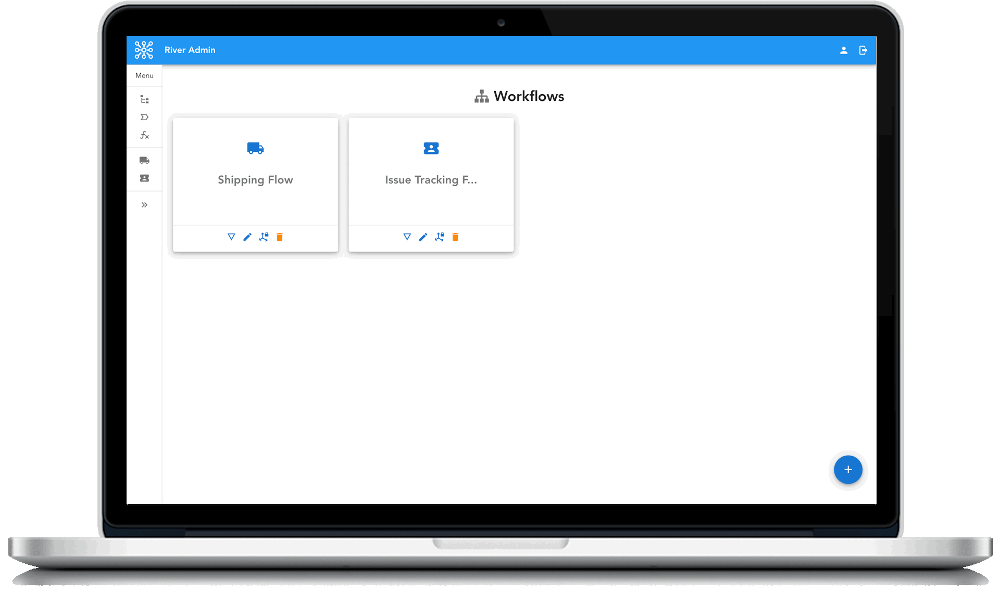
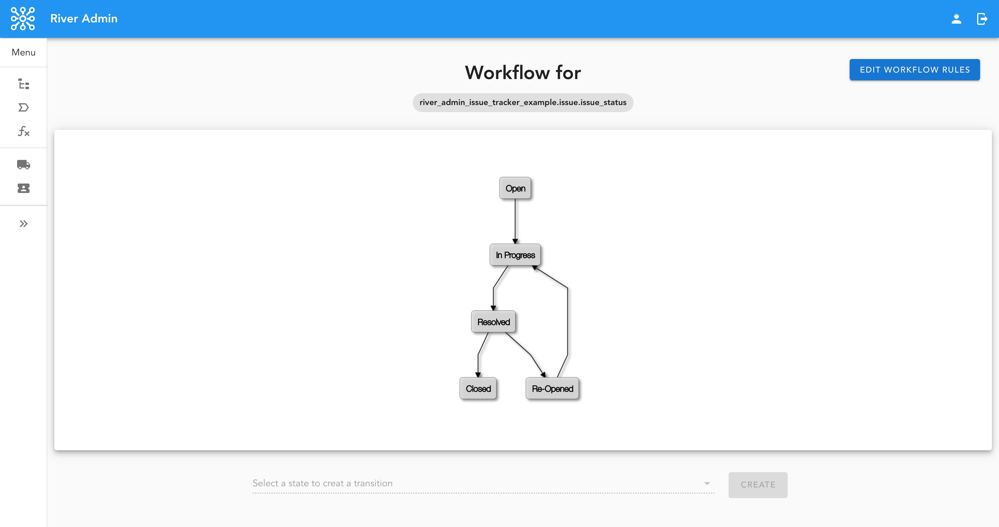
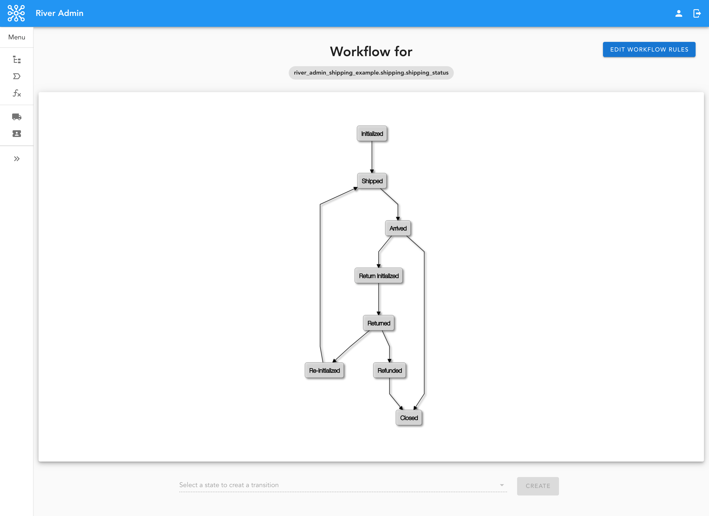

.. |Build Status| image:: https://travis-ci.org/javrasya/river-admin.svg?branch=master
    :target: https://travis-ci.org/javrasya/river-admin

.. |Doc Status| image:: https://readthedocs.org/projects/river-admin/badge/?version=latest
    :target: https://river-admin.readthedocs.io/en/latest/?badge=latest
    :alt: Documentation Status

.. |Licence| image:: https://img.shields.io/github/license/javrasya/river-admin
    :alt: GitHub license
    :target: https://github.com/javrasya/river-admin/blob/master/LICENSE

.. |Coverage Status| image:: https://coveralls.io/repos/github/javrasya/river-admin/badge.svg?branch=master&service=github
    :target: https://coveralls.io/github/javrasya/river-admin?branch=master

.. |Code Quality| image:: https://api.codacy.com/project/badge/Grade/3e7f03e8df5a488f90fb0ed93295c41b
    :target: https://www.codacy.com/manual/javrasya/river-admin?utm_source=github.com&amp;utm_medium=referral&amp;utm_content=javrasya/river-admin&amp;utm_campaign=Badge_Grade

.. |Logo| image:: docs/logo.svg
    :width: 200

River Admin
===========

|Build Status| |Doc Status| |Licence| |Coverage Status| |Code Quality|

\:rocket\: \:rocket\: \:rocket\: ``River Admin`` is a very modern and
a shiny customizable admin extension with user friendly and easy to use
interfaces for django-river_ . The power of it comes from the libraries
it uses on both backend and frontend sides which are ``django-river``,
``django-rest-framework`` ``Vue`` and ``Vuetify``.

.. _`Browser Support`: https://vuetifyjs.com/en/getting-started/browser-support#browser-support
.. _`Vuetify`: https://vuetifyjs.com/en/
.. _`django-river`: https://github.com/javrasya/django-river

|Images|

Donations
=========

This is a fully open source project and it can be better with your donations.

If you are using ``River Admin`` to create a commercial product,
please consider becoming our `sponsor`_  , `patron`_ or donate over `PayPal`_

.. _`patron`: https://www.patreon.com/javrasya
.. _`PayPal`: https://paypal.me/ceahmetdal
.. _`sponsor`: https://github.com/sponsors/javrasya

Documentation
-------------

Online documentation is available at http://river-admin.rtfd.org/.

Getting Started
===============

Requirements
------------

* `django-river`_ >= 3.0.0
* Any ``Python`` version that is supported by `django-river`_
* Any ``Django`` version that is supported by `django-river`_
* Any browser that is supported by `Vuetify`_ (`Browser Support`_)

.. _`Browser Support`: https://vuetifyjs.com/en/getting-started/browser-support#browser-support
.. _`Vuetify`: https://vuetifyjs.com/en/
.. _`django-river`: https://github.com/javrasya/django-river

Installation
------------

**Note:** Before you can set up your workflow, your app
integration with ``django-river`` must be done.
Don't worry it pretty trivial to set it up. To see
how to do it with ``django-river`` please have a
look at `django-river`_

1. Install and enable it

   .. code:: bash

       pip install river-admin

   .. code:: python

       # settings.py

       INSTALLED_APPS=[
           ...
           'river',
           'rest_framework.authtoken',
           'river_admin'
           ...
       ]

       REST_FRAMEWORK = {
           'DEFAULT_AUTHENTICATION_CLASSES': [
               'rest_framework.authentication.BasicAuthentication',
               'rest_framework.authentication.TokenAuthentication',
           ],
           'EXCEPTION_HANDLER': 'river_admin.views.exception_handler'
       }

2. Do migration;

   .. code:: bash

        python manage.py migrate

3. Register ``River Admin`` urls in your app ``urls.py``

   .. code:: python

        urlpatterns = [
            url(r'^', include("river_admin.urls")),
        ]

4. Collect statics and make sure ``STATIC_URL`` is ``/static/`` **(FOR PRODUCTION WHERE DEBUG=False)**;

   .. code:: bash

       python manage.py collectstatic --no-input --no-post-process

5. Run your application;

   .. code:: bash

       python manage.py runserver 0.0.0.0:8000

6. Open it up on the browser and login with an admin user and enjoy the best way of flowing your work ever :-)

   .. code:: bash

       http://0.0.0.0:8000/river-admin/

Out of the Box Examples
-----------------------

``River Admin`` comes with few examples that you can
fiddle with and find your way easier.

**Note:** Enabling them will create their tables and
also the necessary workflow components in
the DB for you. It might be good idea to try
them out on a development database.

Shipping Flow
^^^^^^^^^^^^^

Enable the example app and then run your application

   .. code:: python

       # settings.py

       INSTALLED_APPS=[
           ...
           'river',
           'rest_framework.authtoken',
           'river_admin',
           'river_admin_shipping_example',
           ...
       ]

   .. code:: bash

        python manage.py migrate
        python manage.py bootstrap_shipping_example

|Shipping Workflow Img|

Issue Tracking Flow
^^^^^^^^^^^^^^^^^^^

Enable the example app and then run your application

   .. code:: python

       # settings.py

       INSTALLED_APPS=[
           ...
           'river',
           'rest_framework.authtoken',
           'river_admin',
           'river_admin_issue_tracker_example',
           ...
       ]

   .. code:: bash

        python manage.py migrate
        python manage.py bootstrap_issue_tracker_example

|Issue Tracking Workflow Img|

Contribute
==========

In order to contribute, fork the repository, look at every instructions
in CONTRIBUTE_ before you work then commit your changes and send a pull
request.

Make sure you add yourself to CONTRIBUTORS_.

.. _CONTRIBUTE: https://github.com/javrasya/river-admin/blob/master/docs/contribute.rst
.. _CONTRIBUTORS: https://github.com/javrasya/river-admin/blob/master/CONTRIBUTORS

.. _license:

License
=======

This software is licensed under the `New BSD License`.
See the `LICENSE FILE`_ file in the top distribution directory
for the full license text.

.. _`LICENSE FILE`: https://github.com/javrasya/river-admin/blob/master/LICENSE
